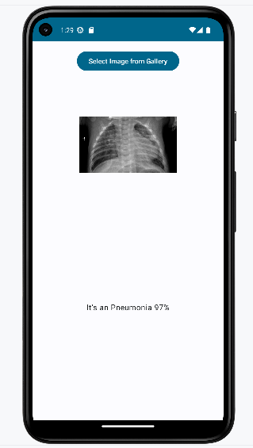

# Android-app-with-tensorflow

## Goal:
Making native Android application for classification, using mainstream technology

## Technology:
Jetpack Compose, Kotlin, TensorFlow

## Main screen image:

## Normal classification case screen image:

## Pneumonia classification case screen image:
